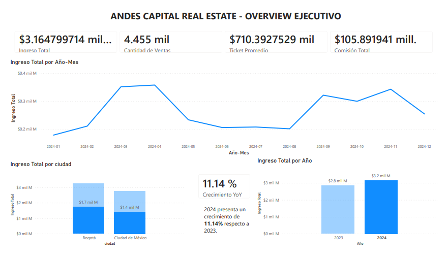
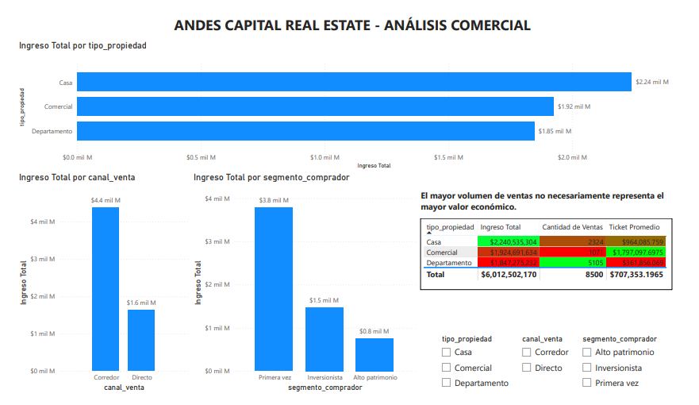
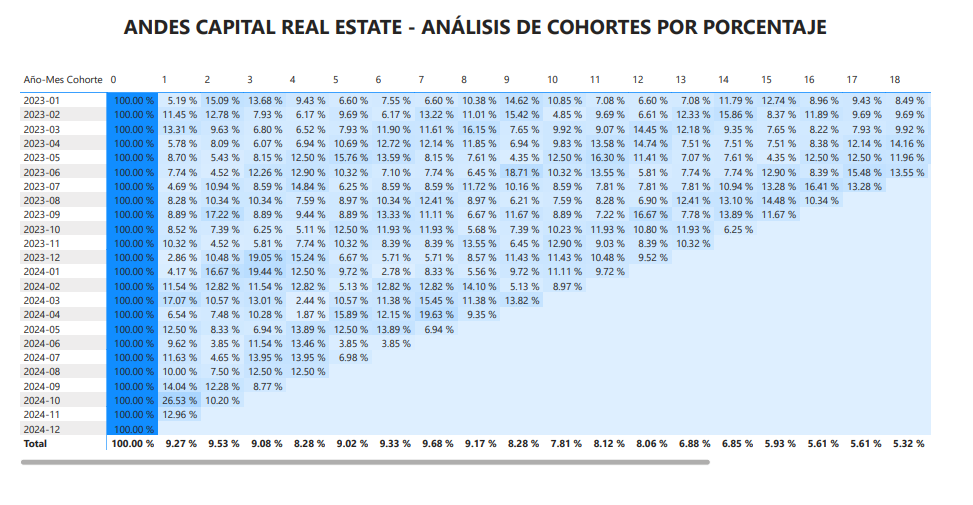

# 🏢 Andes Capital Real Estate – Commercial Analysis

## 📊 Project Overview

This project analyzes the commercial performance of **Andes Capital Real Estate**, a real estate company that manages property sales across different customer segments, property types, cities, and sales channels.

The objective was to transform transactional data into an interactive **Power BI dashboard** capable of supporting strategic decisions related to revenue, sales performance, customer behavior, time trends, and customer recurrence.

The project includes data preparation, star-schema modeling, DAX measures, time intelligence, and cohort analysis.

## 🎯 Business Questions

The dashboard was designed to answer the following business questions:

- What is the total revenue generated by property sales?
- How many properties have been sold?
- What is the average selling price?
- How much total commission has been generated?
- Which property type generates the most revenue?
- Which customer segment purchases the most properties?
- Which sales channel generates the most revenue?
- How have sales evolved over time?
- Is the business growing year over year?
- How is the current year's cumulative performance (YTD)?
- Do customers return to purchase after their first transaction?
- Which customer cohorts generate the most purchases and revenue over time?

## 📂 Dataset

The project uses a transactional fact table and dimensional tables following a **star schema**.

### Fact Table

**`hecho_ventas_propiedades`**

Contains individual property sales transactions, including:

- Sale ID
- Sale date
- Customer ID
- Property ID
- City
- Sale price
- Property type
- Sales channel
- Commission percentage
- Commission amount

### Dimension Tables

**`dim_clientes`**

Contains customer information and segmentation:

- Customer ID
- Customer segment
- Country
- City

**`dim_propiedades`**

Contains property characteristics:

- Property ID
- Property type
- City
- Neighborhood
- Number of bedrooms
- Property size
- Listed price
- Property category

**`dim_fecha`**

Calendar table created specifically for time-based analysis, including:

- Date
- Year
- Month
- Month Number
- Year-Month

## 🧹 Data Preparation

The data preparation process included:

- Validation of data types
- Validation of numeric fields
- Date formatting
- Percentage formatting for commission rates
- Null-value validation
- Duplicate validation on dimension table primary keys
- Creation of the `dim_fecha` calendar table
- Validation of relationships between fact and dimension tables


## 🧩 Data Model

The project uses a **star-schema data model**, with `hecho_ventas_propiedades` as the central fact table and the following dimensions:

```text
                    dim_fecha
                       │
                       │
dim_clientes ─── hecho_ventas_propiedades ─── dim_propiedades
```


## Key Measures
## 📐 Key Measures

The dashboard was built using DAX measures to calculate the main commercial metrics.

### Base Measures

- **Total Revenue**
- **Number of Sales**
- **Average Ticket**
- **Total Commission**

### Context-Aware Measures

Additional measures were created to calculate revenue participation by:

- Property type
- Sales channel
- Customer segment

These measures modify the filter context using DAX functions such as `CALCULATE` and `REMOVEFILTERS`.

### Time Intelligence

Time-based measures were created using the `dim_fecha` calendar table, including:

- Year-to-Date (YTD) Revenue
- Previous Year Revenue
- Year-over-Year (YoY) Growth

### Cohort Analysis

Calculated columns were created in `hecho_ventas_propiedades` to support customer cohort analysis:

- First Purchase Date
- Cohort Month
- Sale Month

These fields were used to build a cohort matrix showing customer purchasing behavior over time.


## 🖥️ Dashboard Structure

The Power BI report contains three main analytical views.

### 1️⃣ Executive Overview

Provides a high-level view of the company's commercial performance.

Includes:

- Total Revenue
- Number of Sales
- Average Ticket
- Total Commission
- Sales trend over time
- Revenue by city
- Year-over-Year growth

**Purpose:** Provide executives with a quick understanding of the overall business performance.

### 2️⃣ Commercial Analysis

Provides a deeper analysis of the main commercial dimensions.

Includes:

- Revenue by property type
- Revenue or sales by sales channel
- Revenue or sales by customer segment
- Conditional-formatting performance table
- Revenue participation tooltips

**Purpose:** Identify the products, channels, and customer segments that have the greatest commercial impact.

### 3️⃣ Customer Cohort Analysis

Analyzes customer recurrence after the first purchase.

The cohort matrix uses:

- **Rows:** Cohort Month
- **Columns:** Sale Month
- **Values:** Number of Sales or Total Revenue

This view helps identify whether customers return to purchase and how different customer cohorts perform over time.


## 🖥️ Dashboard Structure

The Power BI report contains three main analytical views.

### 1️⃣ Executive Overview

Provides a high-level view of the company's commercial performance.

Includes:

- Total Revenue
- Number of Sales
- Average Ticket
- Total Commission
- Sales trend over time
- Revenue by city
- Year-over-Year growth

**Purpose:** Provide executives with a quick understanding of the overall business performance.

### 2️⃣ Commercial Analysis

Provides a deeper analysis of the main commercial dimensions.

Includes:

- Revenue by property type
- Revenue or sales by sales channel
- Revenue or sales by customer segment
- Conditional-formatting performance table
- Revenue participation tooltips

**Purpose:** Identify the products, channels, and customer segments that have the greatest commercial impact.

### 3️⃣ Customer Cohort Analysis

Analyzes customer recurrence after the first purchase.

The cohort matrix uses:

- **Rows:** Cohort Month
- **Columns:** Sale Month
- **Values:** Number of Sales or Total Revenue

This view helps identify whether customers return to purchase and how different customer cohorts perform over time.


## 📸 Dashboard Screenshots

### Executive Overview



### Commercial Analysis



### Customer Cohort Analysis



> Screenshots are included to provide a visual overview of the Power BI dashboard and its main analytical views.


## 📈 Key Findings

### Overall Performance

The business generated approximately **$6.01 billion in total revenue** across **8,500 sales**, with an average ticket of approximately **$707.35 thousand** and total commissions of approximately **$200.63 million**.

### Property Types

The three property types show different strengths:

- **Houses:** Highest total revenue, with approximately **$2.24 billion**
- **Commercial properties:** Highest average ticket, at approximately **$1.80 million**
- **Apartments:** Highest number of sales, with **5,105 transactions**

This shows that the property type with the highest revenue is not necessarily the one with the highest sales volume or average ticket.

### Geographic Performance

**Bogotá** generated the highest revenue, with approximately **$3.24 billion**, compared with approximately **$2.77 billion** generated in Mexico City.

### Sales Channels

The **Broker** channel generated the majority of revenue, with approximately **$4.38 billion**, compared with approximately **$1.63 billion** through the Direct channel.

### Customer Segments

The **First-Time Buyer** segment generated the highest revenue, with approximately **$3.78 billion**, followed by:

- Investors: approximately **$1.47 billion**
- High Net Worth: approximately **$757 million**

### Year-over-Year Growth

Revenue increased from approximately **$2.85 billion in 2023** to **$3.16 billion in 2024**, representing a reported **11.14% YoY growth**.

### Customer Cohorts

The **March and April 2023 cohorts** showed the strongest performance in both revenue and sales volume.

The March 2023 cohort generated approximately **$295.6 million** and **373 sales**, while the April 2023 cohort generated approximately **$244.9 million** and **365 sales**.

The cohort analysis also shows that customer repurchases occur after the initial purchase, although the level of recurrence varies across cohorts and over time.


## 💡 Business Insights

One of the most relevant findings is that **different property types lead different commercial KPIs**:

| Property Type | Revenue | Sales | Average Ticket |
|---|---:|---:|---:|
| House | $2.24B | 2,324 | $964K |
| Commercial | $1.92B | 1,071 | $1.80M |
| Apartment | $1.85B | 5,105 | $362K |

This highlights three distinct commercial profiles:

- **Houses:** Revenue leader
- **Commercial:** High-value transactions
- **Apartments:** High-volume sales

This distinction is important when evaluating commercial strategy because maximizing revenue, transaction volume, and transaction value may require different approaches.


## 🚀 Strategic Recommendations

Based on the dashboard analysis:

- Prioritize the commercialization of **houses** due to their contribution to total revenue.
- Maintain a focused strategy for **commercial properties**, which generate the highest average ticket.
- Leverage the high transaction volume of **apartments** to explore scalable sales strategies.
- Continue strengthening the **broker channel**, which currently generates the majority of revenue.
- Develop retention strategies aimed at increasing repeat purchases from newer customer cohorts.
- Study the characteristics of the **March and April 2023 cohorts** to identify behaviors or acquisition strategies that could potentially be replicated in future cohorts.
- Monitor customer recurrence over time to evaluate the effectiveness of retention initiatives.


## ⚠️ Limitations

The analysis is based on the transactional and dimensional data provided for the project.

The cohort analysis identifies purchasing patterns and recurrence, but recurrence should not automatically be interpreted as customer loyalty or causality.

Additionally, differences between property types, cities, channels, and customer segments describe observed commercial behavior but do not by themselves establish why those differences occur.

Further analysis could incorporate additional variables such as marketing investment, sales representatives, property characteristics, customer demographics, and acquisition costs.


## 🔮 Potential Future Improvements

Possible extensions of the analysis include:

- Customer Lifetime Value (CLV) analysis
- Customer retention and churn metrics
- More advanced cohort retention metrics
- Sales funnel analysis
- Sales-channel efficiency analysis
- Geographic profitability analysis
- Property-level performance analysis
- Predictive models for customer recurrence
- Interactive executive reporting through Power BI Service


## 🛠️ Technologies Used

- **Power BI Desktop**
- **DAX**
- **Power Query**
- **Microsoft Excel**
- Star-schema data modeling
- Time intelligence
- Cohort analysis
- Data visualization and dashboard design

## 📁 Repository Structure

```text
sprint10-final-project/
│
├── dashboard/
│   └── Andes_Capital_Real_Estate.pbix
│
├── images/
│   ├── overview.png
│   ├── commercial-analysis.png
|   ├── cohort-analysis.png
│   └── Proyecto 10 interactivo.pdf
│
└── README.md
```


## 16. How to Use
## ▶️ How to Use

1. Clone or download this repository.
2. Open the `.pbix` file located in the `dashboard/` folder using **Power BI Desktop**.
3. Review the data model and relationships.
4. Explore the three dashboard pages.
5. Use the available filters and visual interactions to explore the business performance.

> The `.pbix` file requires Power BI Desktop to open and interact with the complete report.


## 👤 Author

**Braulio Santiago Esquivel**

Data Analyst Jr. | Database Administrator (DBA) | Mechanical Engineer

Interested in **Data Analytics, SQL, Python, Business Intelligence, Power BI, Tableau, and Data Visualization**.


